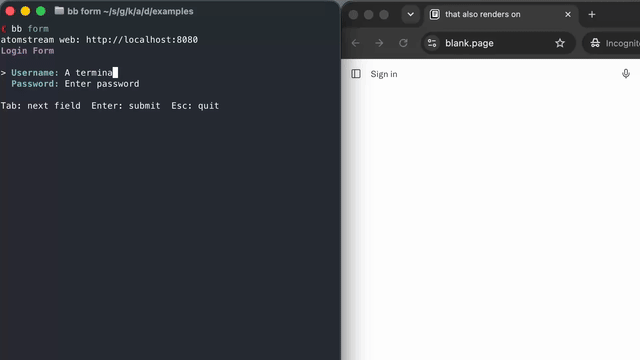

# Atomstream

TUIs are easy and fun to code, but they are not easy to share with friends or colleagues. It is also hard to implement accessibility features for TUIs.

Builds on [charm.clj][charm], renders to the Web with [hyperlith][hyperlith].

[charm]: https://github.com/TimoKramer/charm.clj
[hyperlith]: https://github.com/andersmurphy/hyperlith



## Usage

Atomstream is a drop-in replacement for charm.clj. 

1. In your charm.clj program, replace `charm` with `atomstream`. 

```
(require '[atomstream.core :as charm])
...
```

2. Start the program with `charm/run` as usual. 
3. Open your browser to port 8080

## Goals

1. Stay as close as possible to charm.clj
2. Render unobtrusively to the Web (with themes perhaps?)
3. Use richer Web functionality selectively

## Try it!

```
cd examples
bb tasks
```

# Roadmap
- Mouse support
- Web-native components such as dropdowns?
- Themes
- CLI
- (Maybe) custom components with special rendering for the Web


